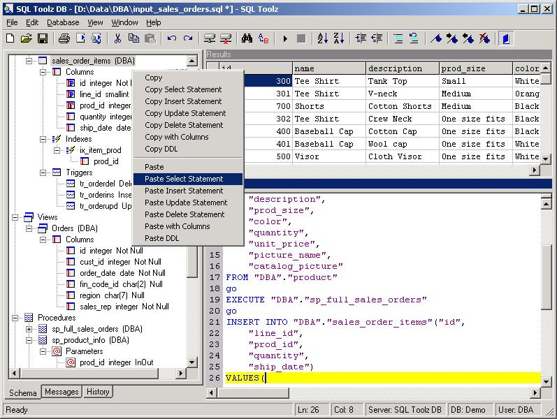



## SQL Toolz

### Description

Application to access Adaptive Server Anywhere databases. Uses CMAX OCX (http://www.compiled.org/files/115/259/cmax20.ocx). Uses RDO for data access. All other components are standard VB components. Help File not included because of licensing restrictions. Sub Main is in sqltool.bas. SQLAny.bas has data logic in it, and could be modified for other databases.
 
### More Info
 
Uses Winmain's CMAX OCX (Not included). Uses RDO for data access. All other components are standard VB components. Help File not included because of licensing restrictions. Sub Main is in sqltool.bas. SQLAny.bas has data logic in it, and could be modified for other databases.

             |
---                |---
**Submitted On**   |2002-12-15 22:32:34
**By**             |[L Stav](https://github.com/Planet-Source-Code/PSCIndex/blob/master/ByAuthor/l-stav.md)
**Level**          |Intermediate
**User Rating**    |4.1 (33 globes from 8 users)
**Compatibility**  |VB 6\.0
**Category**       |[Databases/ Data Access/ DAO/ ADO](https://github.com/Planet-Source-Code/PSCIndex/blob/master/ByCategory/databases-data-access-dao-ado__1-6.md)
**World**          |[Visual Basic](https://github.com/Planet-Source-Code/PSCIndex/blob/master/ByWorld/visual-basic.md)
**Archive File**   |[SQL\_Toolz15139112152002\.zip](https://github.com/Planet-Source-Code/l-stav-sql-toolz__1-41614/archive/master.zip)

